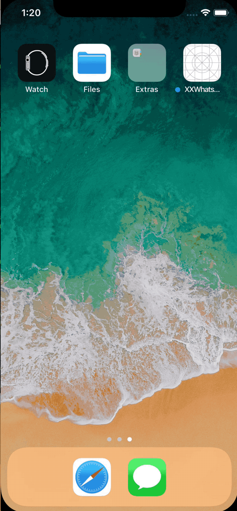

# XXWhatsNewGuide
[](https://cocoapods.org/pods/XXWhatsNewGuide) [](blob/master/License) 


## Installation（CocoaPods）
`pod 'XXWhatsNewGuide'`

## Demo




```objective-c
- (void)viewDidAppear:(BOOL)animated {
    [super viewDidAppear:animated];

    // MARK: - 设置引导第一步
    GuideCase *case1 = [XXWhatsNewGuide giveMeACaseWithKey:@"1"];
    //指定某个view进行高亮
    GuideView *case1_gv1 = [case1 addViewByCloneView:self.imgView1];
    //在引导蒙板上添加视图
    UILabel *case1_lab = [[UILabel alloc] initWithFrame:CGRectMake(24, CGRectGetMaxY(case1_gv1.view.frame)+40, 150, 40)];
    case1_lab.text = @"这是引导说明";
    case1_lab.textColor = [UIColor whiteColor];
    GuideView *case1_gv2 = [case1 addView:case1_lab];

    UIButton *case1_btn = [[UIButton alloc] initWithFrame:CGRectMake(CGRectGetMaxX(case1_gv2.view.frame)+40, CGRectGetMinY(case1_gv2.view.frame), 100, 40)];
    [case1_btn setTitle:@"下一步" forState:UIControlStateNormal];
    [case1_btn setTitleColor:[UIColor whiteColor] forState:UIControlStateNormal];
    case1_btn.backgroundColor = [UIColor blueColor];
    GuideView *case1_gv3 = [case1 addView:case1_btn];

    // MARK: - 设置引导第二步
    GuideCase *case2 = [XXWhatsNewGuide giveMeACaseWithKey:@"2"];

    GuideView *case2_gv1 = [case2 addViewByCloneView:self.imgView1];
    //指定区域进行高亮
    [case2 hollowout:CGRectMake(CGRectGetMaxX(case2_gv1.view.frame)+20, CGRectGetMinY(case2_gv1.view.frame), 200, 40) type:(HollowoutTypeOval) radius:0];

    UIImage *case2_img = [UIImage imageNamed:@"3"];
    GuideView *case2_gv2 = [case2 addViewWithImage:case2_img frame:CGRectMake(CGRectGetMinX(case2_gv1.view.frame), CGRectGetMaxY(case2_gv1.view.frame)+30, case2_img.size.width,  case2_img.size.height)];

    UIButton *case2_btn = [[UIButton alloc] initWithFrame:CGRectMake(CGRectGetMinX(case2_gv2.view.frame), CGRectGetMaxY(case2_gv2.view.frame)+30, 100, 40)];
    [case2_btn setTitle:@"知道了" forState:UIControlStateNormal];
    [case2_btn setTitleColor:[UIColor whiteColor] forState:UIControlStateNormal];
    case2_btn.backgroundColor = [UIColor blueColor];
    GuideView *case2_gv3 = [case2 addView:case2_btn];

    // MARK: - 设置引导动作
    //点击下一步
    [case1_gv3 addActionForNextCase:case2];
    //点击消失
    [case2_gv3 addActionForDismiss];

    // MARK: - 显示引导
    [case1 show];
}
```
